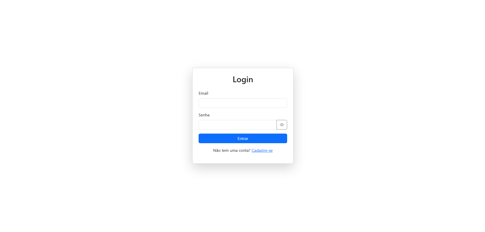
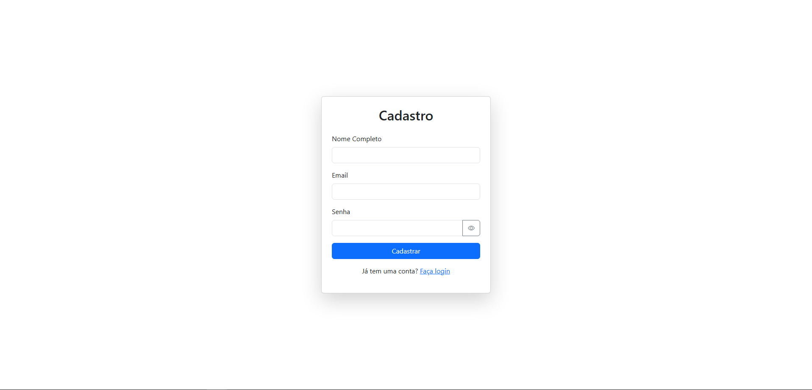
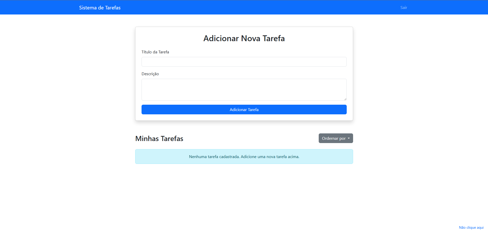
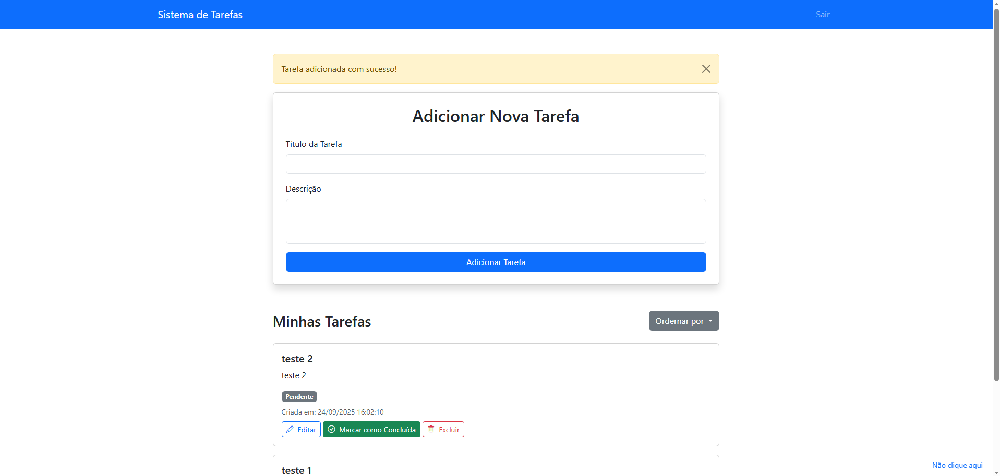
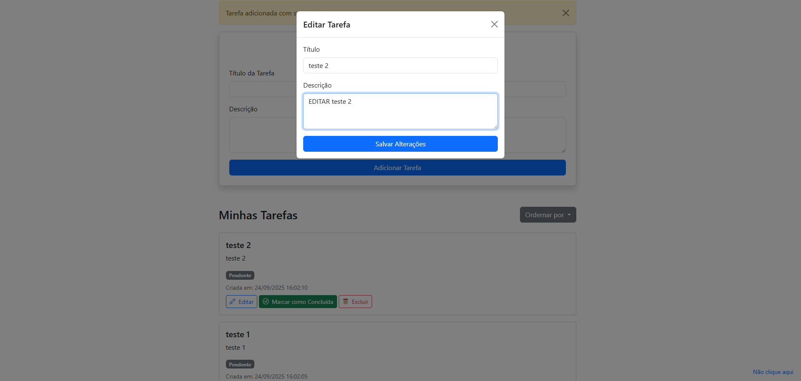

# Sistema de Gerenciamento de Tarefas

### Objetivo: Criar um sistema simples de gerenciamento de tarefas (To-Do List)

Tecnologias Utilizadas:

⦁	Backend: PHP 5.6 (conforme descrito na vaga)

⦁	Frontend: HTML, CSS, JavaScript

⦁	Framework: Bootstrap 5

⦁	Banco de Dados: MariaDB

⦁	Ambiente de Desenvolvimento: Docker + Docker Compose 

### Como executar o projeto:

Para rodar este projeto localmente, você precisa ter o Docker e o Docker Compose instalados em seu sistema.

1. Navegue até o diretório do projeto: 

Abra seu terminal e vá para a pasta raiz do projeto (todo-app) que contém o arquivo docker-compose.yml

2. Inicie os contêineres:
    
        docker-compose up -d

Se der algum erro quando for executar o comando docker-compose up. Verifique se o Docker desktop está aberto e em execução.

3. Acesso ao sistema:

Após sucesso do comando docker o sistema estará acessível em http://localhost:8080.

### Como verificar o banco de dados:

Testar pelo terminal é uma das formas mais simples para uma verificação rápida, pois você não precisa de nenhuma ferramenta externa. Use o comando docker-compose exec para entrar no contêiner do banco de dados e executar comandos diretamente nele.

        docker-compose exec db mariadb -utodo_user -pexample_user_password todo_db -e "SELECT * FROM users;"

        docker-compose exec db mariadb -utodo_user -pexample_user_password todo_db -e "SELECT * FROM tasks;"
        
---
###  📋 Funcionalidades

O sistema inclui as seguintes funcionalidades

⦁ Login: Acesse o sistema com as credenciais cadastradas.

⦁ Registro: Crie uma nova conta com nome, e-mail e senha.

#### Gerenciamento de Tarefas: Após o login, você pode:

⦁ Adicionar novas tarefas com título e descrição.

⦁ Editar tarefas existentes.

⦁ Excluir tarefas.

⦁ Marcar tarefas como "pendente" ou "concluída".

⦁ Ordenar a lista de tarefas por data de criação ou por status

---
### 🖼️ Telas

⦁ Login e Registro.



⦁ Principal com a lista de tarefas vazia.


⦁ Principal com tarefas adicionadas.


⦁ Edição de uma tarefa


### Mudanças:
Essa parte serve para justificar as mudanças que fiz.

Fiz algumas alterações no docker-compose.yml :
```
    yaml
    version: '3'
    services:
    web:
        image: php:apache
        ports:
        - "8080:80"
        volumes:
        - ./src:/var/www/html
        - ./php-custom.ini:/usr/local/etc/php/conf.d/php-custom.ini
        depends_on:
        - db
        environment:
        - PHP_INI_SCAN_DIR=/usr/local/etc/php/conf.d
        command:
        bash -c "docker-php-ext-install mysqli && apache2-foreground"
    db:
        image: mariadb
        environment:
        MYSQL_ROOT_PASSWORD: example_root_password
        MYSQL_DATABASE: todo_db
        MYSQL_USER: todo_user
        MYSQL_PASSWORD: example_user_password
        volumes:
        - todo-data:/var/lib/mysql
        - ./bd:/docker-entrypoint-initdb.d
        ports:
        - "3307:3306"
    volumes:
    todo-data:
```
volumes e environment: php-custom.ini permite ter um controle melhor dos erros.

command: comando de instalação para garantir que a extensão PHP necessária para se conectar ao banco de dados seja instalada automaticamente quando o contêiner é iniciado. Evita erros de conexão.

Na parte de bd adicionei um entrypoint no volume que permite que o init.sql seja executado automaticamente na primeira vez que o contêiner do banco de dados é iniciado, criando a estrutura de tabelas necessária.


### 👤 Autor

Guilherme Gonzaga Coelho Krohling